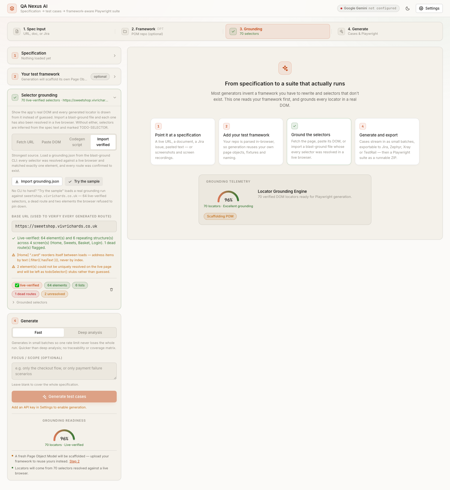
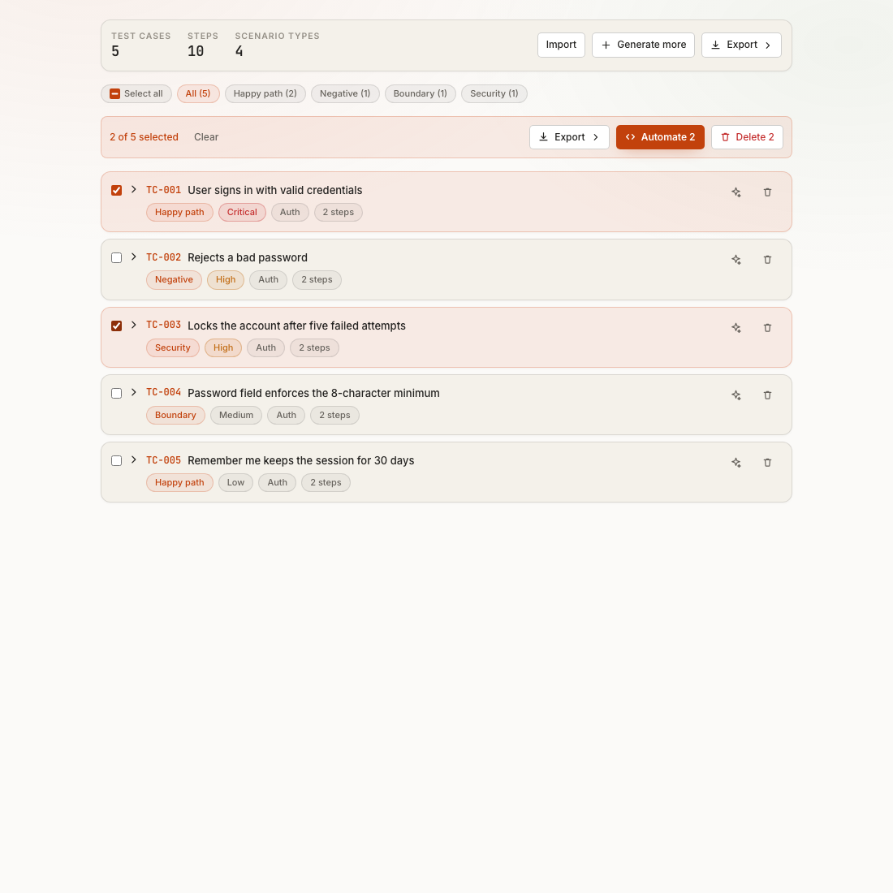

# QA Nexus AI

**Turn a specification into reviewable test cases and a Playwright suite that reuses your existing test framework.**

**🔗 Live demo:** [qa-nexus-ai-five.vercel.app](https://qa-nexus-ai-five.vercel.app/) — no install needed. Add
your own API key in Settings, or try the one-click **Try the sample** grounding path described below with no
key needed to see live-verified selector data flow through the app.
**📖 Reviewer guide:** [docs/reviewer-guide.md](docs/reviewer-guide.md) — a feature-by-feature walkthrough with
screenshots, built for someone seeing this project for the first time.

QA Nexus AI reads a requirement — a live URL, a PDF/DOCX spec, a Jira issue, pasted text, or a screen recording
— generates a detailed, exportable test suite from it, and then writes the Playwright automation. Two things
make it different: **it reads your test framework first**, so specs call your own page objects and follow your
conventions; and **it grounds every selector in a real DOM**, so the suite it hands you actually runs.

---

## The problem

AI test generators produce code you can't merge.

They invent a `LoginPage` class you already have. They use CSS selectors when your team standardised on
`getByTestId`. They name files `LoginTests.ts` when your repo uses `login.spec.ts`. And they invent selectors
for elements that were never on the page, so the first run is a wall of timeouts. Every generated file becomes
a rewrite job, so the time "saved" comes straight back — and teams quietly stop using the tool.

The gap isn't the model's test-design ability. It's that the model has never seen your codebase, and has never
seen your application.

## The solution

Four steps, one screen. Two of them are optional — but they are the two that decide whether the output is
mergeable.

1. **Load a specification.** A URL (fetched and stripped to readable text through the server proxy), an
   uploaded PDF / DOCX / Markdown / TXT / HTML document, a Jira issue key, or pasted requirement text.

2. **Upload your test framework** *(a differentiator, and optional)*. Drop in a `.zip` of your Playwright
   repo or pick the folder directly. It is parsed **entirely in your browser** — your source never leaves your
   machine. QA Nexus extracts:
   - every page-object class, its locator properties and its method signatures
   - your test fixtures and their types
   - your conventions: file naming, directory layout, locator strategy, test-runner import line, indentation,
     quote style, semicolons, and the `baseURL` from `playwright.config.ts`

   Only that distilled signature — class names and method signatures, never file contents — is injected into
   the generation prompt.

3. **Ground the selectors** *(the other differentiator, and optional)*. Fetch the page through the proxy, paste
   its `outerHTML`, paste a `npx playwright codegen` recording, or **import a live-verified `grounding.json`**
   from the [`blast-ground` CLI](tools/blast-ground). Every element is distilled into a Playwright locator,
   repeating structures (product grids, result lists) are detected separately, and anything that can't be
   grounded is emitted as a marked `TODO-SELECTOR` rather than a plausible-looking guess.

   Grounding has **two honestly-labelled tiers**, because they are not the same guarantee:

   | Tier | Source | What it actually proves |
   |---|---|---|
   | **best-effort (static)** | URL fetch · DOM paste · codegen | The selector was *derived from markup that really exists*. Nothing checked that it resolves to exactly one node. |
   | **✅ live-verified** | `blast-ground` import | A real headless browser was asked `locator.count()` for every candidate and **only those matching exactly one element were kept**. Routes were fetched and confirmed. |

   Adding a best-effort source on top of an import demotes the whole context back to best-effort — the flag has
   to stay true for *every* selector in the set, or the generator would skip its route check on a false premise.

4. **Generate and export.** Test cases first (reviewable, editable, filterable, with per-case grounding scores),
   then a runnable Playwright suite as a ZIP.

### Before and after, same test case

Without a framework, the model invents its own world:

```ts
// tests/login.spec.ts
import { test, expect } from '@playwright/test'

test('TC-001 — user signs in with valid credentials', async ({ page }) => {
  await page.goto('/login')
  await page.locator('#email').fill('user@example.com')
  await page.locator('#password').fill('secret')
  await page.locator('.btn-primary').click()
  await expect(page).toHaveURL(/dashboard/)
})
```

With your framework uploaded, it writes against what you already have:

```ts
// src/tests/login.spec.ts
import { test, expect } from '../fixtures/base.fixture';

test('TC-001 — user signs in with valid credentials', async ({ loginPage, page }) => {
  await loginPage.goto('/login');
  await loginPage.login('user@example.com', 'secret');
  await expect(page).toHaveURL(/dashboard/);
});
```

Same test case. The second one is a pull request; the first one is homework.

### Proof, not vibes — a real run

Most generators stop at "here is some code." The two claims below were produced by actually running the tools
in this repo against a live public site ([sweetshop.vivrichards.co.uk](https://sweetshop.vivrichards.co.uk)),
not written by hand.

**1. Grounding against a live browser**

```console
$ cd tools/blast-ground && npm install && npx playwright install chromium
$ npm run ground -- https://sweetshop.vivrichards.co.uk/sweets --page Sweets \
    --also https://sweetshop.vivrichards.co.uk/login=Login --out grounding.json

→ grounding Sweets (https://sweetshop.vivrichards.co.uk/sweets)
  ✓ 26 verified · 2 collection(s) · 0 unresolved · 0 dead route(s)
→ grounding Login (https://sweetshop.vivrichards.co.uk/login)
  ✓ 13 verified · 1 collection(s) · 0 unresolved · 0 dead route(s)

Wrote grounding.json
```

This is the part a hosted web app structurally cannot do. It reaches `localhost`, VPN-only staging and
login-gated pages, and it knows things static HTML cannot — that an `<a>` without `href` gets **no ARIA role**,
or that `.card-title` matches four nodes rather than one. A candidate matching many nodes is **rejected, not
disambiguated with `.nth(i)`**: positional locators fail *intermittently*, which is worse than failing loudly.

**2. The generated suite is actually run — and the gate catches what static checks cannot**

Generated with `gemini-flash-lite-latest` from the sweetshop URL above, using the live-verified grounding, then
executed against the real site. 4 of the 8 generated cases were selected for automation; 34 files exported.

**Before — the gate catches a real defect:**

```console
$ npm run verify-suite -- ../../playwright-suite-sweetshop --base-url https://sweetshop.vivrichards.co.uk

→ npm install
→ npx playwright install chromium
→ npx tsc --noEmit
→ npx playwright test

── verify-suite ──────────────────────────────────────────
✓ install: dependencies installed
✓ browser-install: chromium ready
✓ typecheck: tsc --noEmit passed
✗ run: 2 passed, 1 failed, 2 skipped (fixme/todo)

Failed tests:
  ✗ TC-002: Verify keyboard navigation and focus management across interactive product elements
    Error: expect(locator).toBeFocused() failed

❌ verify-suite failed
```

**The locator was correct. The assumption about the page was not.** `.card` and `.addItem` both came straight
from the live-verified grounding — that part of the model's output was never in question. What failed was line
9: `await expect(card1Button).toBeFocused()`, immediately after `.focus()`. Tracing it against the live DOM
showed why — `.addItem` renders as `<a class="btn btn-success btn-block addItem">`, with **no `href` and no
`tabindex`**. A browser never puts an anchor like that in the tab order, so `.focus()` silently no-ops and
focus stays on `<body>`. The model wrote a keyboard-navigation test against a control that cannot receive
keyboard focus at all — a defect in the generated test's assumptions about the page, not in the selector. It is
the same href-less-anchor ambiguity the [CLI's own README](tools/blast-ground/README.md) already calls out as a
thing static parsing cannot know and a live browser can.

**After — fixed by hand, re-verified against the live site, stable across repeated runs:**

```console
✓ install: node_modules already present, skipped
✓ typecheck: tsc --noEmit passed
✓ run: 3 passed, 0 failed, 2 skipped (fixme/todo)

✅ verify-suite passed
```

The fix keeps the keyboard-navigation assertion for what is genuinely keyboard-reachable — the first real `Tab`
lands on the nav brand link, confirmed live — and exercises `.addItem` the only way an actual user could:
by click, then asserts the basket count. The two skipped specs are `test.fixme` stubs for steps the grounding
run couldn't reach a selector for, left honestly incomplete rather than guessed.

That is the exact class of defect nothing upstream can catch. Grounding proves a selector **exists**; the type
checker proves the code **compiles**; only running it proves the assertion **holds** — and once it doesn't, the
fix is small precisely because everything else about the suite was already correct.

So the honest claim is not "the AI writes perfect tests." It is: **you find out which ones are wrong before you
open the pull request, instead of at 3am — and closing the gap is minutes, not a rewrite.**

> **Reviewers:** the CLI is a local Node tool by design — that is exactly why it can reach targets a hosted app
> cannot. You do **not** need it to try the feature. Open the deployed app → **3 Selector grounding** →
> **Import verified** → **Try the sample**, and a committed run of the CLI loads in one click: 64 live-verified
> selectors, 6 repeating structures, 1 dead route and 2 elements the browser refused to pin down. Watch the
> badge flip from *best-effort (static)* to *✅ live-verified*.

---

## Features

| | |
|---|---|
| **Five spec sources** | Live URL, uploaded document (PDF/DOCX/MD/TXT/HTML), Jira issue key, pasted text, plus screenshots / wireframes / screen recordings for vision-capable models |
| **Framework-aware generation** | Page objects, fixtures and conventions extracted client-side and injected into the prompt; new methods are spliced into your real files |
| **Selector grounding** | URL fetch, DOM paste or codegen recording → grounded locators, with repeating-structure detection |
| **Live-verified grounding** | `blast-ground` CLI drives a real headless browser, keeps only selectors matching exactly one element, and confirms routes — importable into the app as a `grounding.json` |
| **Suite verification** | `verify-suite` installs, typechecks and *actually runs* the generated suite, reporting real pass/fail from Playwright's JSON reporter |
| **Two generation modes** | *Fast* — one pass to test cases. *Deep analysis* — requirement extraction → human review → coverage planning → generation → self-critique |
| **Traceability matrix** | Requirements down, scenario types across; click a cell to filter the cases that cover it. Gaps are explicit |
| **Testability review** | Each extracted requirement is scored testable / weak / untestable, with the specific defect named and a one-click suggested rewrite |
| **Detailed test cases** | 8–30 atomic steps per case with action / test data / expected result, across seven scenario types |
| **Grounding confidence** | A second LLM pass scores every case 0–100 on how traceable it is to the spec, surfaced as a badge |
| **Full editing** | Edit any case, step, priority or component inline; add or delete steps; delete cases |
| **Bulk selection** | Tick any subset — then export, automate or delete just those. Select-all respects the active filter, and automating a subset keeps that scope on regenerate |
| **CSV / Excel import** | Bring an existing suite in — delimiter and column names are auto-detected |
| **Four export formats** | Jira CSV importer, Zephyr Scale, Xray, TestRail — plus raw JSON |
| **Runnable Playwright ZIP** | Page objects, specs, `playwright.config.ts`, `tsconfig.json`, `.env.example`, `.gitignore`, auth setup and a GitHub Actions workflow |
| **Contract checks** | Route verification, spec/page-object drift, strict-mode cardinality violations, invented locators and fixed waits are all caught and reported — never silently patched |
| **Stall recovery** | A rate limit mid-run doesn't lose completed work: generation resumes from a checkpoint, automatically retrying other configured providers first |
| **Four AI providers** | Groq, Google Gemini, OpenAI, OpenRouter — keys stay in your browser |
| **Two themes** | Midnight (dark) and Latte (warm cream), following your OS until you choose |

## Tech stack

- **Frontend** — React 18, TypeScript (strict), Vite 5, Tailwind CSS with a token-based design system
- **AI** — provider-agnostic layer over Groq / Gemini / OpenAI / OpenRouter, with JSON-mode requests, Zod
  schema validation and a single informed repair round-trip on invalid output
- **Framework parsing** — JSZip plus a purpose-built source scanner (`src/services/frameworkAnalyzer.ts`);
  runs in the browser, no upload
- **Backend** — Express proxy (`server/`) that forwards provider and Jira calls; SSRF-guarded URL fetching,
  rate limiting, and parameter clamping. On Vercel the same code runs as a serverless function (`api/index.mjs`)
- **Selector grounding** — an HTML distiller that ranks locator candidates by robustness, a codegen-script parser,
  and an AST-based auditor (`src/services/astLocatorAudit.ts`) that tracks locator identity across statements to
  catch strict-mode violations regex cannot see
- **Testing** — Vitest + Testing Library, 284 tests across the analyzer, DOM distiller, suite builders, grounded
  pipeline, CSV import, editing UI and proxy security rules

### Why a proxy at all?

Provider APIs reject browser origins, and shipping keys through a server you control is the only way to make
CORS work without embedding them in the bundle. The proxy is deliberately dumb: it holds no state, stores no
keys, and clamps every client-supplied parameter before forwarding.

## How to run

**Prerequisites:** Node 18+ and an API key from at least one provider — [Groq](https://console.groq.com/keys)
and [Google AI Studio](https://aistudio.google.com/apikey) both have free tiers.

```bash
git clone <your-fork-url>
cd qa-nexus-ai
npm install
npm run dev:full
```

That starts the Vite dev server on **http://localhost:5173** and the Express proxy on **:3001**.

**If either port is already in use**, run on free ones — both variables must agree, or the browser calls the
wrong server:

```bash
BACKEND_PORT=3101 VITE_API_URL=http://localhost:3101/api npm run dev:full
```

In local development the proxy accepts any loopback origin, so Vite moving to :5174 is fine. To pin the
allow-list (e.g. for a shared or deployed instance), set `ALLOWED_ORIGINS=https://qa.example.com,https://…`.

Open the app, click **Settings**, paste your API key, and hit **Test & load** to pull that account's model list.
Keys are stored in your browser's `localStorage` and sent per request — nothing is written server-side and
nothing is committed.

### Scripts

| Command | What it does |
|---|---|
| `npm run dev:full` | Frontend + proxy together (the normal way to run it) |
| `npm run dev` | Vite dev server only |
| `npm run server` | Express proxy only |
| `npm run build` | Type-check then production build |
| `npm test` | Vitest run |
| `npm run lint` | ESLint over `src/` and `server/` |

### Deployment

The repo deploys to Vercel as-is: `vercel.json` builds the Vite app to `dist/` and routes `/api/*` to
`api/index.mjs`, which mounts the same Express routers used locally. No environment variables are required —
users supply their own provider keys in the UI.

## Demo

**Live app:** **[qa-nexus-ai-five.vercel.app](https://qa-nexus-ai-five.vercel.app/)**

**Reviewer guide:** **[docs/reviewer-guide.md](docs/reviewer-guide.md)** walks through every feature —
framework-aware generation, both grounding tiers, the `blast-ground` CLI, bulk case selection and export — with
screenshots and pointers to exactly where in the UI to find each one. Start there if you want a guided tour
instead of exploring cold.

**Fastest way to see the core differentiator with no API key:** open the live app → **Step 3, Selector
grounding → Import verified → Try the sample**. That loads a real, committed `blast-ground` run and flips the
grounding badge from *best-effort (static)* to *✅ live-verified* — no install, no key, no waiting.

| | |
|---|---|
|  |  |
| *Import a real `blast-ground` run — the badge flips from best-effort to live-verified* | *Tick cases, then act on just that subset* |

## Project structure

```
src/
  services/
    aiService.ts           Provider-agnostic LLM layer + fast-path generation prompts
    groundedPipeline.ts    Deep mode: extract → analyse → plan → generate → critique, with checkpoints
    frameworkAnalyzer.ts   Client-side framework parsing → FrameworkProfile → prompt context
    domDistiller.ts        HTML → candidate Playwright locators + repeating-structure detection
    codegenParser.ts       `playwright codegen` output → recorded actions
    groundingResolver.ts   Candidate → single-match resolution logic (browser-agnostic, so it unit-tests)
    groundingImport.ts     Zod contract + parser for a blast-ground `grounding.json`
    astLocatorAudit.ts     AST pass catching collection-locator strict-mode violations
    pomBuilder.ts          Deterministic Page Object Model layers (locators, pages, fixtures)
    automationBuilder.ts   LLM output → validated, scaffolded project (framework-aware or greenfield)
    automationTemplates.ts Deterministic project scaffold (config, CI, base page, auth setup)
    schemas.ts             Zod contracts for every model response
    jsonParser.ts          Lossless JSON extraction + one informed repair round-trip
    exportService.ts       Jira / Zephyr / Xray / TestRail CSV, CSV/Excel import, ZIP export
    documentParser.ts      URL, PDF, DOCX and HTML → plain text
    jiraService.ts         Jira issue fetch, ADF → text, PII redaction
  components/              SpecInput, FrameworkUploader, GroundingPanel, RequirementsReview,
                           CoverageMatrix, TestCasesDisplay, AutomationPanel, StalledGenerationPanel
  context/SettingsContext  Multi-provider key vault (browser-local)
  hooks/useTheme.ts        Latte / Midnight theme with no-flash first paint
server/                    Express proxy: providers, Jira, URL fetch, security middleware
api/index.mjs              Vercel serverless entry wrapping the same routers
public/
  sample-grounding.json    A real blast-ground run, shipped so the import path is testable with no install
tools/blast-ground/        Local Node CLI: live-browser selector verification + verify-suite
                           Own package.json — excluded from the app's build, tests, lint and deploy
```

## Design notes

A few decisions worth calling out, because they're the difference between a demo and a tool:

- **The locator layer is never guessed silently.** Anything the model can't derive from the spec is emitted as
  a marked `TODO-SELECTOR` and reported in the UI, rather than shipped as a plausible-looking selector that
  fails at 3am.
- **Contract violations are reported, not auto-fixed.** If generated specs call a method your framework doesn't
  define, you're told which one. Rewriting it automatically would hide that the model went off-framework.
- **Every model response is schema-validated.** On failure, the actual Zod error is sent back to the model for
  exactly one repair attempt — an informed retry, not a blind re-roll.
- **Test titles are normalised to their case id**, so runner output maps back to the test case without manual
  cross-referencing.
- **Scaffolding is templated, not generated.** `playwright.config.ts`, `tsconfig.json`, the CI workflow and the
  entire locators layer are deterministic, so the model's budget goes entirely to the part that actually varies.
- **A stall never costs completed work.** Generation checkpoints after each chunk; a rate limit resumes on
  another provider from the exact point it stopped, rather than restarting.
- **The human checkpoint is early.** In deep mode you review extracted requirements *before* any test case is
  written, because correcting one misread requirement is cheaper than correcting the twelve cases built on it.
- **"Verified" means verified.** Static grounding is labelled *best-effort*, never *verified*, because parsing
  markup cannot prove a selector resolves to exactly one node — only a live browser can. The stronger label is
  reserved for a `blast-ground` import, and is dropped the moment an unverified selector joins the set.

## Limitations

- Framework parsing is a source scanner, not a TypeScript compiler. It handles conventional Playwright POM
  layouts well; heavy metaprogramming or generated page objects may not be detected.
- The folder picker uses `webkitdirectory`, supported in Chromium and WebKit browsers. The `.zip` path works
  everywhere.
- Generation quality tracks the model you pick. Larger models produce noticeably better step granularity.
- Analysis is capped at 400 source files per framework upload.
- URL grounding reads server-rendered HTML. For client-rendered SPAs the initial response is often an empty
  shell — the app detects this and tells you to paste the live DOM instead, or import a `blast-ground` file.
- Running a suite from inside the browser is not possible — browser automation needs a real driver and
  installed browser binaries, which a web page cannot reach. That is why `verify-suite` is a local CLI. The app
  itself gives you the exact commands, one copy away, via **Copy run commands**.
- `blast-ground` grounds *the rendered state of the URLs you point it at* — not "every locator in the app".
  Elements that only appear after an interaction (modals, dropdowns, wizard steps) need a codegen recording or
  a `--also` per route. See [its README](tools/blast-ground#limits--what-it-can-and-cannot-capture).
- Attachments are capped at 12MB in total, and need a vision-capable model (Gemini, GPT-4o).

## License

MIT
