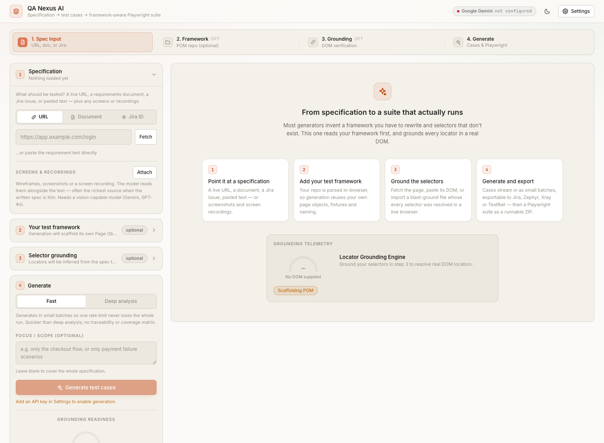
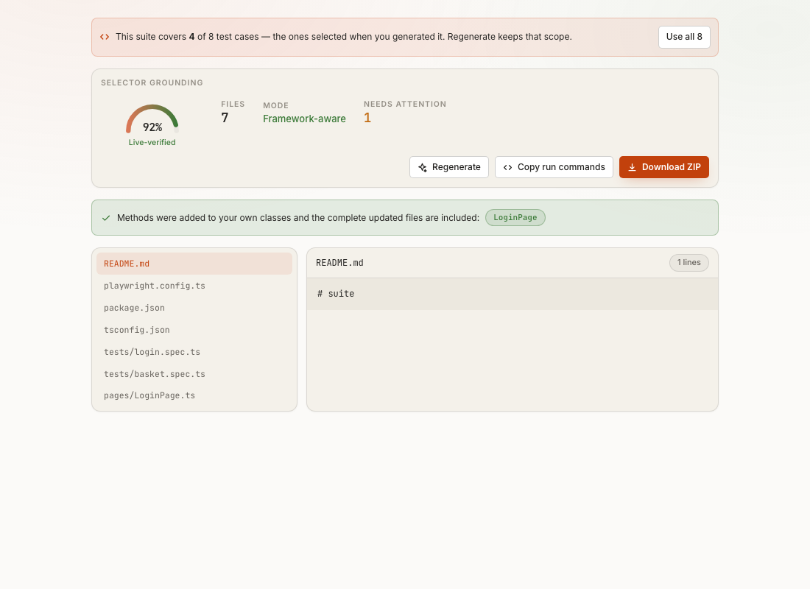

# QA Nexus AI — Reviewer Guide

A feature-by-feature walkthrough for anyone seeing this project for the first time. Screenshots below are real
captures from the running app, not mockups.

**Live demo:** [qa-nexus-ai-five.vercel.app](https://qa-nexus-ai-five.vercel.app/) · **Repo:** [back to README](../README.md)

---

## 1. The one flow this app does

Spec in → test cases out → Playwright suite out. A live URL, an uploaded PDF/DOCX/MD/HTML document, a Jira
issue key, or pasted text → reviewable, editable test cases → a runnable Playwright TypeScript Page Object
Model suite, exportable as a ZIP. Two generation modes: **Fast** (one chunked, checkpointed pass — resumes
across rate limits) and **Deep analysis** (requirement extraction → human review → coverage planning →
generation → self-critique).

## 2. Framework-aware generation

The first differentiator. Most AI test generators invent their own page objects; this one reads yours first.

Drop a `.zip` of your Playwright repo, or pick the folder directly, in **Step 2** — parsed **entirely
client-side** via JSZip, so your source never leaves the browser. The app extracts page-object classes, method
signatures, fixtures, and conventions (naming, locator strategy, quote style, `baseURL`). Generated specs then
call *your* page classes with *your* method names, instead of inventing a parallel set you'd have to reconcile
by hand. See the README's "Before and after" section for the exact diff this produces.

## 3. Selector grounding — two honestly-labelled tiers

The second differentiator, and the one most worth a reviewer's attention.

| Tier | Sources | What it actually proves |
|---|---|---|
| **best-effort (static)** | URL fetch · Paste DOM · Codegen recording | Selector was derived from markup that really exists. Nothing checked it resolves to exactly one node. |
| **✅ live-verified** | Import `grounding.json` | A real headless browser ran `locator.count()` on every candidate — only exact single-node matches kept. Routes were fetched and confirmed live. |

**Step 3 → Import verified → Try the sample** — no API key needed. It loads a real, committed grounding run
(64 elements, 6 collections, 1 dead route, 2 unresolved) against a live public site. The badge flips from
*best-effort* to *✅ live-verified*, and the automation panel's grounding meter changes with it.

Adding a best-effort source on top of an import **demotes the context back to best-effort** — the guarantee
has to hold for every selector, or the generator would wrongly skip its own route check.

## 4. blast-ground CLI + verify-suite

A local Node tool (`tools/blast-ground/`) that produces the live-verified files the app imports, plus a gate
that runs the generated suite for real. Kept out of the web build entirely — its own `package.json`, excluded
from `tsc`/tests/lint/Vercel.

- **Grounding** drives real headless Chromium against a live page. Reaches `localhost`, VPN-only staging and
  login-gated targets a hosted web app structurally cannot. A selector matching many nodes is **rejected**,
  never disambiguated with `.nth(i)` — positional locators fail intermittently, which is worse than failing
  loudly.
- **verify-suite** installs, typechecks (`tsc --noEmit`), and **actually runs** the generated suite via
  Playwright's JSON reporter — real pass/fail, not a guess. See the README's before/after: a real generated
  spec failed a live run, the root cause was traced, fixed, and re-verified stable.

## 5. Test case review & bulk actions

Every case, step, priority and component is inline-editable before anything gets automated. Filter by scenario
type. Tick individual cases or **Select all** within the active filter (never silently reaching hidden cases),
then:

- **Export selected** — Jira CSV, Zephyr, Xray, TestRail or JSON, scoped to just the ticked cases.
- **Automate selected** — generate a Playwright suite from only that subset; regenerating keeps the same scope
  until you choose "Use all".
- **Delete selected** — bulk remove, with the selection self-pruning if a case is deleted individually.

## 6. Export & automation output

The ZIP contains page objects, spec files, `playwright.config.ts`, `tsconfig.json`, `.env.example`,
`.gitignore`, an auth setup file, and a GitHub Actions workflow — a project you can `npm install && npm test`,
not a code snippet. Contract violations (route mismatches, strict-mode cardinality issues, invented locators,
fixed waits) are **reported in the UI**, never silently auto-fixed — hiding that the model went off-framework
would defeat the point.

## 7. Fastest path to see it work

**No API key needed (2 minutes):** open the live demo → Step 3 "Selector grounding" → *Import verified* →
*Try the sample*. Watch the tier badge and grounding meter change live.

**With a free API key (5 more minutes):** paste a URL in Step 1, generate test cases (Fast mode), tick a few,
click *Automate N*, then *Download ZIP*.

---

See the [README](../README.md) for the full problem statement, tech stack, and a real end-to-end run with
actual pass/fail output.
